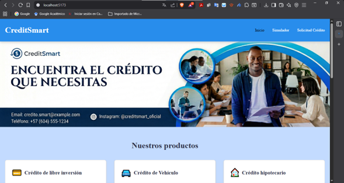
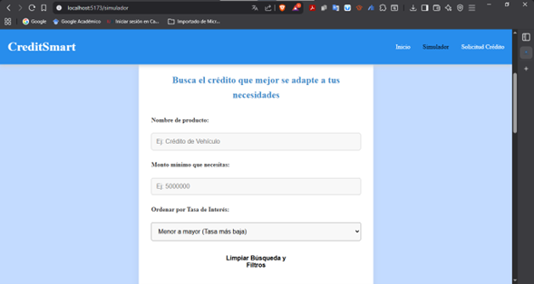
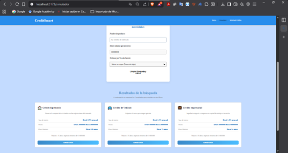
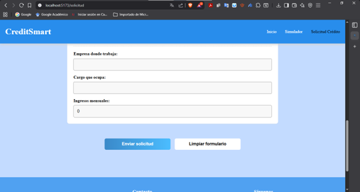
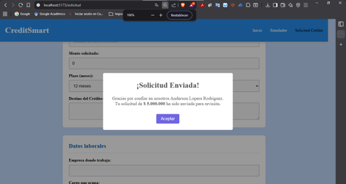
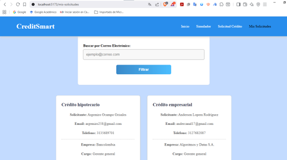

# 💳 CreditSmart: Gestión y Simulación de Créditos

Este template proporciona una configuración mínima para hacer que React funcione en Vite.

---

## 👨‍💻 Información del Proyecto

### Nombre del Estudiante
Anderson Lopera Rodríguez

## 🎥 Video de Sustentación

Puedes ver la explicación completa del proyecto CreditSmart, su funcionalidad dinámica con React y las implementaciones de los filtros y formularios, en el siguiente enlace:

[**Ver Video de Presentación**](https://drive.google.com/file/d/1-XBgma9yWZtbdOWLmZC6wIxt1DP4YzBZ/view?usp=sharing)

### Descripción del Proyecto
CreditSmart es una aplicación web dinámica construida con React que simula la gestión y presentación de productos crediticios. El objetivo principal es ofrecer a los usuarios una interfaz clara para explorar diferentes tipos de créditos (como "Crédito de libre inversión" y "Crédito de Vehículo"), ver sus detalles (tasas, montos, plazos) y utilizar una herramienta de simulación de préstamos.

**Actualización:** Ahora la aplicación incluye persistencia de datos en la nube y un panel de administración para que los usuarios gestionen sus solicitudes realizadas.

---

## 🚀 Tecnologías Utilizadas

* **Frontend Framework:** React
* **Build Tool:** Vite
* **Routing:** React Router (Manejo de rutas como `/`, `/simulador`, `/solicitud`, `/mis-solicitudes`)
* **Estilos:** CSS3 / Estilos modulares (Diseño Responsivo adaptado a Móviles y Tablets)
* **Formato de Moneda:** API nativa de JavaScript (`Intl.NumberFormat`)
* **Base de Datos:** Firebase (Firestore Database)
* **Alertas e Interacción:** SweetAlert2 (Modales para confirmaciones y errores)

---

## 📦 Instalación y Ejecución

Sigue estos pasos para configurar y ejecutar el proyecto CreditSmart en tu entorno local.

### Prerrequisitos
Asegúrate de tener instalado [Node.js](https://nodejs.org/) (versión LTS recomendada) y npm.

### Pasos de Instalación

1.  **Clonar el repositorio:**
    ```bash
    git clone [https://github.com/Ander-17/creditsmart.git](https://github.com/Ander-17/creditsmart.git)
    cd creditsmart
    ```

2.  **Instalar dependencias:**
    ```bash
    npm install
    ```

3.  **Configuración de Variables de Entorno (IMPORTANTE ⚠️):**
    Para que la base de datos funcione, necesitas configurar las credenciales de Firebase.
    * Crea un archivo llamado `.env` en la raíz del proyecto.
    * Copia el contenido del archivo `.env.example` (si existe) o agrega tus credenciales con el siguiente formato:
    ```properties
    VITE_API_KEY=tu_api_key_aqui
    VITE_AUTH_DOMAIN=tu_proyecto.firebaseapp.com
    VITE_PROJECT_ID=tu_project_id
    VITE_STORAGE_BUCKET=tu_storage_bucket
    VITE_MESSAGING_SENDER_ID=tu_sender_id
    VITE_APP_ID=tu_app_id
    ```

4.  **Ejecutar la aplicación en modo desarrollo:**
    ```bash
    npm run dev
    ```
    La aplicación se iniciará en `http://localhost:5173`.

---

## ✨ Nuevas Funcionalidades Implementadas

### Panel "Mis Solicitudes"
Se ha agregado un módulo de gestión donde el usuario puede:
* **Visualizar:** Ver automáticamente las últimas 5 solicitudes registradas, ordenadas por fecha reciente.
* **Editar:** Modificar el monto y el plazo de una solicitud existente (la cuota se recalcula automáticamente).
* **Eliminar:** Borrar solicitudes de la base de datos con una confirmación de seguridad.
* **Búsqueda:** Filtrar solicitudes por correo electrónico.

### Diseño Responsivo (Mobile First)
La interfaz se adapta automáticamente a diferentes tamaños de pantalla:
* **Móvil:** El menú se compacta, las columnas se apilan y las imágenes decorativas se ocultan para mejorar la legibilidad.
* **Escritorio:** Diseño expandido con Hero Banner visual y tablas de datos completas.

---

## 📷 Pantallazos de la Aplicación

---

### Página Principal (Home)


---

### Simulador de Crédito




---

### Formulario de Solicitud
  



---

### Panel "Mis Solicitudes"


---

## 📚 Información Adicional de la Plantilla Vite

### Plugins Oficiales

Actualmente, dos *plugins* oficiales están disponibles:

-   [@vitejs/plugin-react](https://github.com/vitejs/vite-plugin-react/blob/main/packages/plugin-react) usa [Babel](https://babeljs.io/) (o [oxc](https://oxc.rs) cuando se usa en [rolldown-vite](https://vite.dev/guide/rolldown)) para *Fast Refresh*.
-   [@vitejs/plugin-react-swc](https://swc.rs/) usa [SWC](https://swc.rs/) para *Fast Refresh*.

### React Compiler

El *React Compiler* no está habilitado en esta plantilla debido a su impacto en el rendimiento de desarrollo y construcción (*dev* & *build*). Para agregarlo, consulta [esta documentación](https://react.dev/learn/react-compiler/installation).

### Expansión de la Configuración ESLint

Si estás desarrollando una aplicación de producción, recomendamos usar TypeScript con reglas de *lint* con reconocimiento de tipos habilitadas. Consulta la [plantilla TS](https://github.com/vitejs/vite/tree/main/packages/create-vite/template-react-ts) para obtener información sobre cómo integrar TypeScript y [`typescript-eslint`](https://typescript-eslint.io) en tu proyecto.